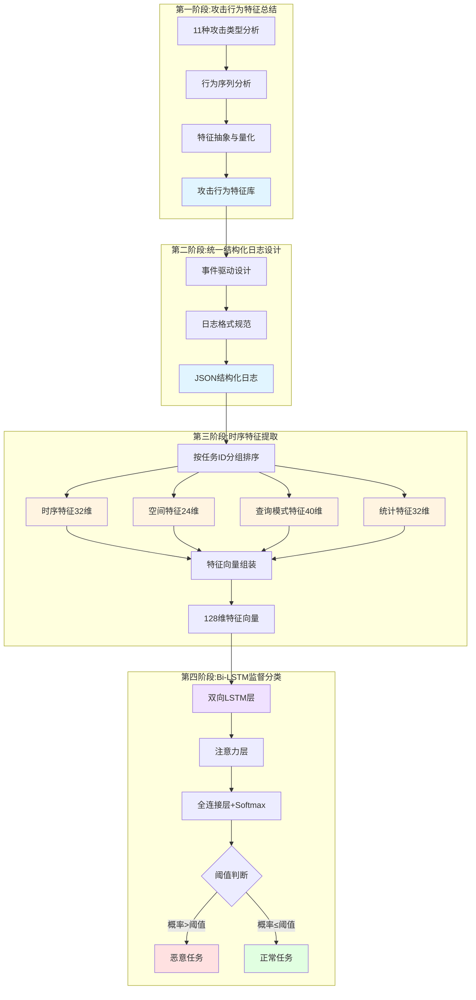

### 4.2.2 技术路线

动态检测方法的技术路线分为四个递进阶段。第一阶段针对11种攻击类型总结核心行为特征与检测信号,识别隐私泄露类攻击的高频查询和系统性扫描特征、数据推理类攻击的边界查询和时空关联特征、系统攻击类的资源竞争和请求洪泛特征,输出结构化攻击行为特征库。第二阶段基于特征库设计以事件为驱动的统一结构化日志格式,将任务执行过程分解为task_start、model_query、data_access、resource_usage、task_error和task_end等离散事件,采用JSON结构包含通用字段(时间戳、事件类型、上下文信息)和事件特定字段(如model_query的查询参数、执行时间等)。第三阶段从结构化日志序列提取128维特征向量,按任务ID分组排序后从时序(32维)、空间(24维)、查询模式(40维)和统计(32维)四个维度计算特征并归一化。第四阶段构建Bi-LSTM模型进行二分类,网络包含输入层、双向LSTM层(两层,每层64个隐藏单元)、注意力层和全连接层,通过前向和后向信息传递捕获时序依赖关系,使用交叉熵损失函数和Adam优化器训练,输出任务恶意概率并通过阈值判断分类结果。

动态分析整体技术路线如图4-X所示。技术路线从攻击行为分析出发,通过特征总结构建行为特征库,基于特征库设计统一的事件驱动日志格式,从结构化日志中提取多维度时序特征,最终利用Bi-LSTM模型实现恶意任务的智能识别。该路线将攻击行为分析、日志工程、特征工程和深度学习有机结合,相比传统基于规则的检测方法具有更强的泛化能力,相比基于单次请求的异常检测能够捕获完整行为序列,相比基于统计特征的检测能够自动提取高层次特征组合,有效应对海洋科学云计算平台面临的多样化安全威胁。

图4-X 动态分析整体技术路线图
